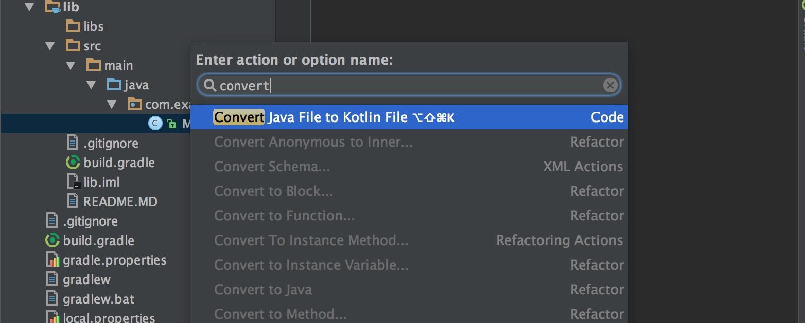

We will use Spark to handle HTTP calls

Add Spark dependency
---
in /lib/build.gradle
```
compile "com.sparkjava:spark-core:2.6.0"
compile 'org.slf4j:slf4j-simple:1.6.1' // for logging
```

Time to implement Java/Kotlin main method

Convert MyClass to kotlin
---


Write main function and configure build
---
~~class MyClass~~
```
fun main(args: Array<String>) {
    // TODO write code
}
```
in /lib/build.gradle
```
apply plugin: "application"
...
mainClassName = "com.example.MyClassKt"
```

Time for Hello world
---
code in `main` will look like this:
```
Spark.get("/kotlin/hello") { _, _ -> "Hello Kotlin User Group!" }
```
run `./gradlew :lib:run`
and
open http://localhost:4567/kotlin/hello in browser

Now some real API call with Json
---
Let's return list of Kotlin Workshop event members as Json
Put db file /lib/src/main/resources/members.db
Now we can access this resource through class loader:
```
javaClass.classLoader.getResource("members.db")
```
Gson will handle converting to Json, add dependency to /lib/build.gradle
```
compile "com.google.code.gson:gson:2.8.1"
```
We are ready to read members from DB, so lets create Dao
```
class MembersDao {
    fun all() = javaClass.classLoader
            .getResource("members.db")
            .readText()
            .reader()
            .buffered()
            .readLines()
            .map { it.split(" ") }
            .map { Member(it[0], it[1].toInt()) }
}

data class Member(val name: String, val paid: Int)
```
Now with Spark we can return members list
```
val dao = MembersDao()
Spark.get("kotlin/members") { _, _ -> dao.all().toJson() }
```
toJson() is an extension function that converts List<Member> to proper Json String
```
val gson = Gson()
fun Any?.toJson(): String = gson.toJson(this)
```
run `./gradlew :lib:run` and open http://localhost:4567/kotlin/members in browser

